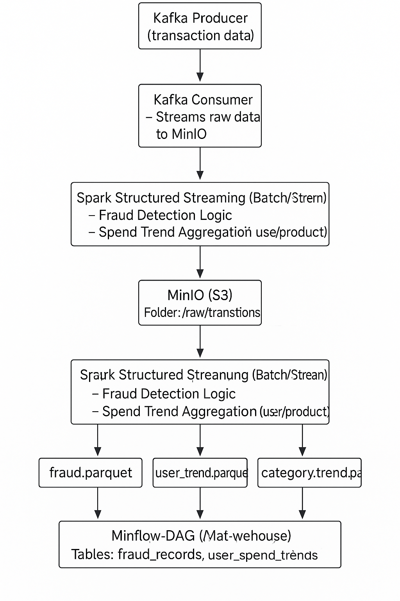

# Smart Fraud Detection Data Pipeline

## 📌 Overview
This project implements an end-to-end data engineering pipeline that ingests retail transaction data in real time, enriches it with user and product information, detects potential fraud, and stores curated results for analytics and reporting.

The pipeline follows production-ready data engineering patterns using Apache Kafka, Spark Structured Streaming, Apache Airflow for orchestration, MinIO as S3-compatible object storage, and Snowflake as the analytical data warehouse.

---

## 🏗️ Architecture Overview

  
*Diagram of the data flow from Kafka to Snowflake*


| Component           | Technology              |
|---------------------|--------------------------|
| Streaming Platform  | Apache Kafka (`confluent_kafka`) |
| Data Processing     | Apache Spark Structured Streaming |
| Storage Layer       | MinIO (S3-compatible object storage) |
| Orchestration       | Apache Airflow (modular DAGs) |
| Data Warehouse      | Snowflake               |
| Language            | Python                  |
| Data Format         | Parquet (partitioned)   |

---

##  Features

- Simulates real-time financial transactions using Kafka.
- Detects fraud using rule-based and conditional logic.
- Calculates:
  - Per-user spend trends
  - Product/category popularity metrics
- Writes partitioned Parquet files to MinIO (by year/month/day).
- Loads curated datasets into Snowflake using Airflow DAGs.
- Modular design with separate consumer, analytics, and loader logic.

---
---

## 📥 Getting Started
✅ Prerequisites

Make sure the following tools are installed on your system:

- Docker
- Docker Compose
- Python 3.8+
- Snowflake Account (optional – for warehouse testing)


### 📦 Clone the Repository

```bash
git clone https://github.com/thakare2912/Smart-Fraud-Detection-Data-Pipeline.git
cd Smart-Fraud-Detection-Data-Pipeline
```
### 📦 Start Docker 

```bash
docker-compose up -d
```
### Check running services: 
```bash
docker-compose ps
```
## Data Ingestion & Processing

###  Kafka Producer
``` bash
python src\kafka\producer\transaction_producer.py
```
- Simulates financial transactions with fields like `user_id`, `amount`, `payment_method`, etc.
- Sends them to a Kafka topic (`transactions`).

###  Kafka Consumer 
``` bash
python src\kafka\consumer\consumer.py
```
- Consumes messages from Kafka
- Writes raw transaction data to MinIO
- User and product reference data are manually added to MinIO


### Spark Structured Streaming 
```bash
cd src\spark\jobs\spark.py
```
``` bash
docker exec -it smart_retail_fraud_trend_pipeline-spark-master-1 \
/opt/bitnami/spark/bin/spark-submit \
--master spark://spark-master:7077 \
--packages org.apache.hadoop:hadoop-aws:3.3.4,com.amazonaws:aws-java-sdk-bundle:1.12.262 \
/opt/spark/jobs/spark.py

```


### 📊 Output Storage 
```text
minio/
└── smart-retail-raw/
    └── process/
        ├── fraud_records/
        ├── user_spend_trends/
        └── category_trends/
```
 
*Processed and partitioned Parquet data stored in MinIO*

## ⏱️ Airflow Orchestration

Apache Airflow is used to **orchestrate and monitor** the end-to-end fraud detection pipeline.

The Airflow DAG manages:
- Execution of Spark streaming and batch jobs
- Dependency handling between processing steps
- Retry logic and failure recovery
- Scheduling of incremental loads into Snowflake

### Airflow Workflow
1. Trigger Spark job for fraud detection
2. Validate processed data in MinIO
3. Load data incrementally into Snowflake
4. Mark pipeline completion


### Querying in Snowflake
``` bash
SELECT *
FROM SMART_RETAIL_DB.PUBLIC.FRAUD_RECORDS
LIMIT 10;
```


*Sample output from Snowflake showing fraud records*

## 🧠 Key Learnings

Through building this end-to-end fraud detection data pipeline, I gained hands-on experience with real-world data engineering challenges and best practices, including:

- Designing real-time data pipelines using Apache Kafka and Spark Structured Streaming for continuous ingestion and processing.
- Handling schema evolution and data enrichment by joining streaming data with static reference datasets (users and products).
- Implementing rule-based fraud detection logic and computing window-based aggregations for user spend and category trends.
- Working with S3-compatible object storage (MinIO), including partitioned Parquet layouts for efficient downstream analytics.
- Orchestrating complex pipelines using Apache Airflow, managing task dependencies, retries, and incremental data loads.
- Building custom Docker images to resolve dependency and environment issues, ensuring consistent and reproducible execution.
- Integrating Spark with cloud data warehouses (Snowflake) using incremental load patterns suitable for production systems.
- Improving observability and debugging skills by analyzing logs across Kafka, Spark, and Airflow components.

## 🎯 Why This Project Matters

This project reflects real-world data engineering scenarios such as streaming ingestion, fault-tolerant processing, orchestration, and cloud data warehousing. It demonstrates my ability to design, build, debug, and document scalable data pipelines rather than isolated scripts.


